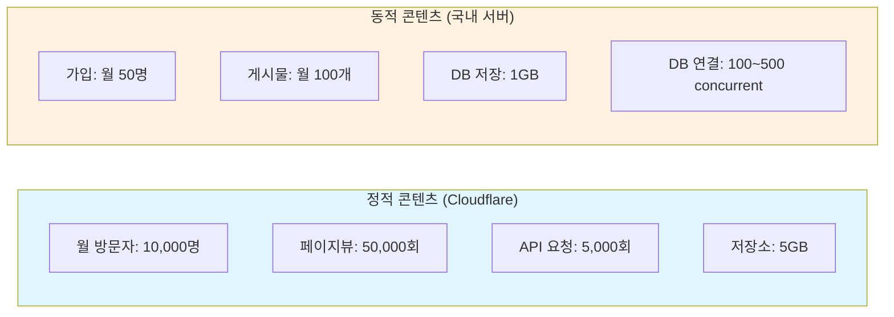
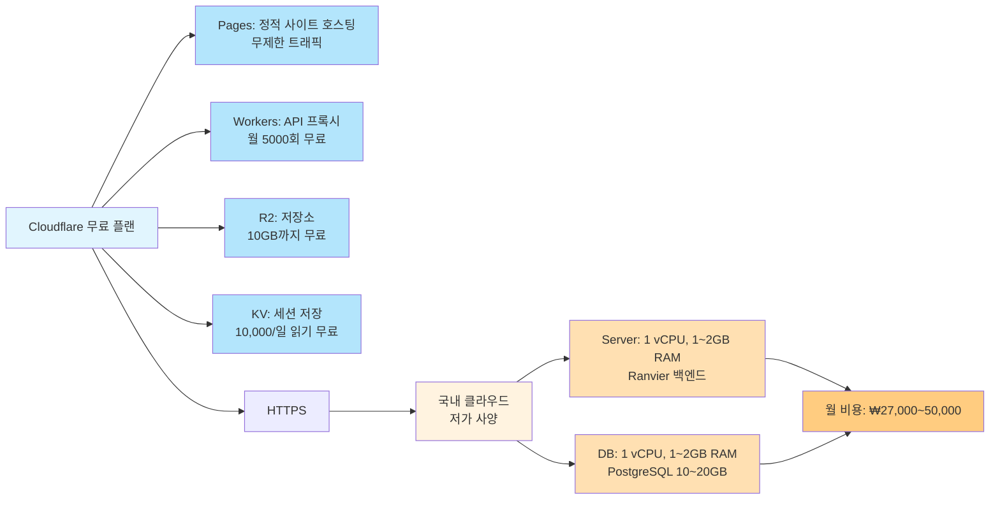
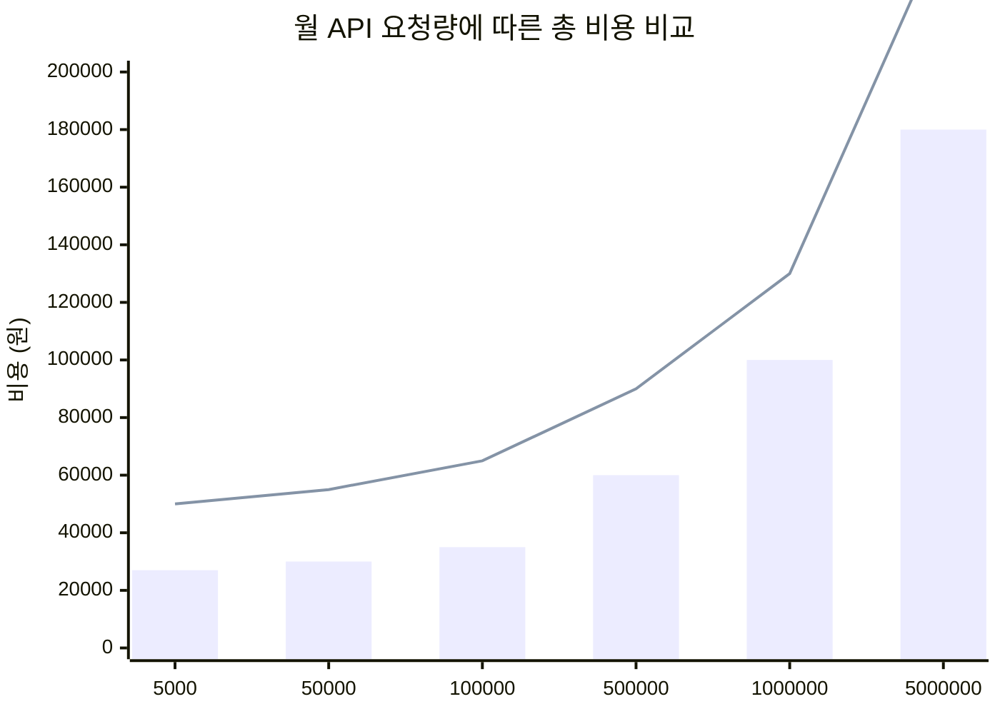
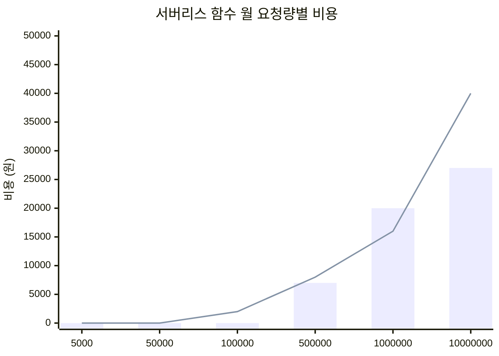
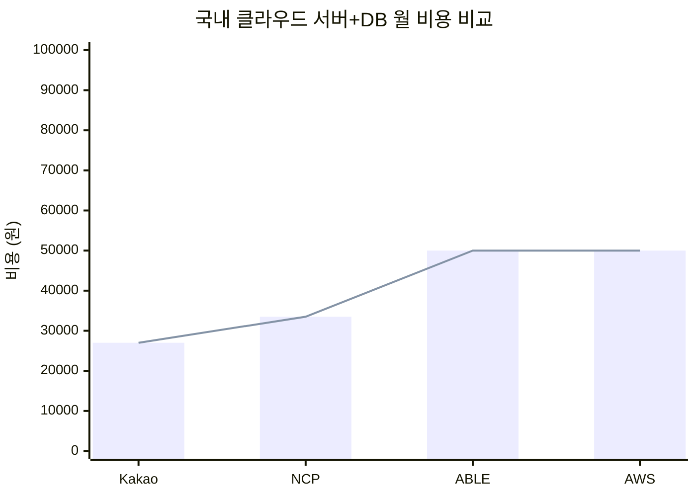
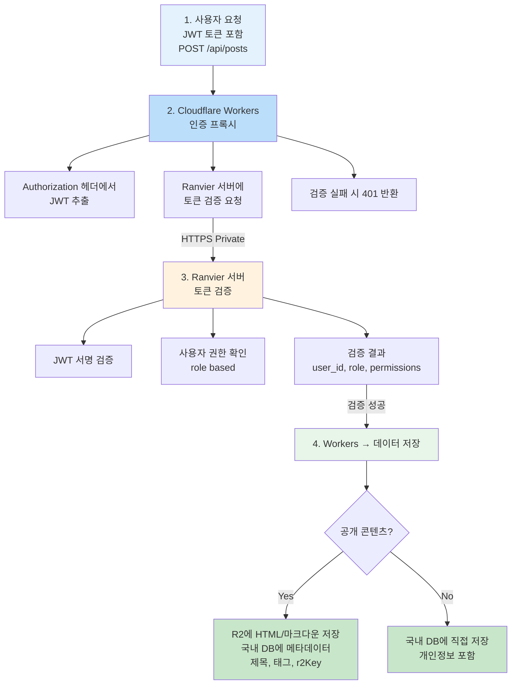
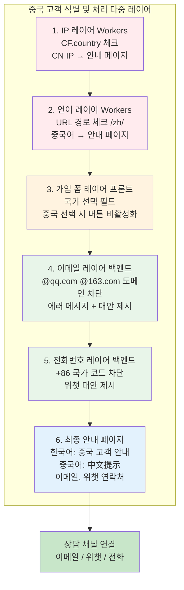

# 클라우드 서비스 비용 비교

## 1. 사용 시나리오



---

## 2. Cloudflare 비용

### 2.1 Cloudflare Pages (정적 호스팅)

| 플랜 | 무료 | 유료 ($20/월) |
|-----|------|---------------|
| 빌드 | 500회/월 | 무제한 |
| 대역폭 | 무제한 | 무제한 |
| 요청 | 무제한 | 무제한 |
| **비용** | **₩0** | **₩27,000** |

### 2.2 Cloudflare Workers

| 플랜 | 무료 | Paid ($5/월) | Paid ($20/월) |
|-----|------|--------------|---------------|
| 요청 | 100,000/일 | 10M/월 | 50M/월 |
| CPU 시간 | 10ms/요청 | 30ms/요청 | 50ms/요청 |
| 월 요청량 | ~300만 | ~1,000만 | ~5,000만 |
| **비용** | **₩0** | **₩7,000** | **₩27,000** |

**우리 경우:** 월 5,000회 요청 → **무료 플랜으로 충분**

### 2.3 Cloudflare R2 (저장소)

| 플랜 | 무료 | 유료 |
|-----|------|-----|
| 저장 | 10GB | $0.015/GB |
| Class A 요청 | 1,000만/월 | $4.50/100만 |
| Class B 요청 | 무제한 | $0.36/100만 |
| egress | 무제한 | - |
| **비용 (5GB)** | **₩0** | **₩100** |

### 2.4 Cloudflare 합계

| 항목 | 무료 플랜 | Paid 플랜 |
|-----|----------|----------|
| Pages | ₩0 | ₩27,000 |
| Workers | ₩0 | ₩7,000~27,000 |
| R2 (5GB) | ₩0 | ₩100 |
| **합계** | **₩0** | **~₩55,000** |

---

## 3. AWS 비용 (Seoul 리전)

### 3.1 정적 콘텐츠 (대안)

| 서비스 | 무료 | 유료 |
|-------|------|-----|
| S3 + CloudFront | 1년 무료 (5GB + 25,000번 요청) | $0.023/GB + $0.008/1,000회 |
| 월 50,000회 + 5GB | ₩0 (1년) | ₩20,000~30,000 |

### 3.2 EC2 (Ranvier 서버)

| 인스턴스 | vCPU | 메모리 | 월 비용 |
|---------|------|--------|---------|
| t3.micro | 1 | 1GB | ₩15,000 |
| t3.small | 1 | 2GB | ₩30,000 |
| t3.medium | 2 | 4GB | ₩60,000 |

### 3.3 RDS PostgreSQL

| 인스턴스 | vCPU | 메모리 | 저장소 | 월 비용 |
|---------|------|--------|--------|---------|
| db.t3.micro | 1 | 1GB | 20GB | ₩35,000 |
| db.t3.small | 1 | 2GB | 20GB | ₩70,000 |
| db.t3.medium | 2 | 4GB | 20GB | ₩140,000 |

### 3.4 AWS 합계

| 구성 | 월 비용 |
|-----|--------|
| EC2 t3.micro + RDS t3.micro | **₩50,000** |
| EC2 t3.small + RDS t3.small | **₩100,000** |
| EC2 t3.medium + RDS t3.medium | **₩200,000** |

---

## 4. NCP (네이버 클라우드) 비용

### 4.1 정적 콘텐츠 (대안)

| 서비스 | 무료 | 유료 |
|-------|------|-----|
| S3 + CDN (Global) | 없음 | ₩0.022/GB + ₩0.02/1,000회 |
| 월 50,000회 + 5GB | - | ₩15,000~20,000 |

### 4.2 Server (VPC)

| 사양 | vCPU | 메모리 | 월 비용 |
|-----|------|--------|---------|
| t2.micro | 1 | 1GB | ₩8,500 |
| t2.small | 1 | 2GB | ₩17,000 |
| t2.medium | 2 | 4GB | ₩34,000 |

### 4.3 CDB (PostgreSQL)

| 사양 | vCPU | 메모리 | 저장소 | 월 비용 |
|-----|------|--------|--------|---------|
| t2.micro | 1 | 1GB | 10GB | ₩25,000 |
| t2.small | 1 | 2GB | 10GB | ₩50,000 |
| t2.medium | 2 | 4GB | 10GB | ₩100,000 |

### 4.4 NCP 합계

| 구성 | 월 비용 |
|-----|--------|
| Server t2.micro + CDB t2.micro | **₩34,000** |
| Server t2.small + CDB t2.small | **₩67,000** |
| Server t2.medium + CDB t2.medium | **₩134,000** |

---

## 5. Kakao Cloud 비용

### 5.1 Server

| 사양 | vCPU | 메모리 | 월 비용 |
|-----|------|--------|---------|
| nano | 0.25 | 1GB | ₩5,000 |
| micro | 0.5 | 1GB | ₩7,000 |
| small | 1 | 2GB | ₩15,000 |

### 5.2 Managed DB (PostgreSQL)

| 사양 | vCPU | 메모리 | 저장소 | 월 비용 |
|-----|------|--------|--------|---------|
| db-t2.micro | 1 | 1GB | 10GB | ₩20,000 |
| db-t2.small | 1 | 2GB | 10GB | ₩40,000 |
| db-t2.medium | 2 | 4GB | 10GB | ₩80,000 |

### 5.3 Kakao Cloud 합계

| 구성 | 월 비용 |
|-----|--------|
| Server micro + DB micro | **₩27,000** |
| Server small + DB small | **₩55,000** |
| Server medium + DB medium | **₩120,000** |

---

## 6. ABLE Cloud (KT) 비용

### 6.1 Server

| 사양 | vCPU | 메모리 | 월 비용 |
|-----|------|--------|---------|
| ct-02 | 1 | 2GB | ₩20,000 |
| ct-04 | 2 | 4GB | ₩40,000 |
| ct-08 | 4 | 8GB | ₩80,000 |

### 6.2 Managed DB (PostgreSQL)

| 사양 | vCPU | 메모리 | 저장소 | 월 비용 |
|-----|------|--------|--------|---------|
| m2-01 | 1 | 2GB | 10GB | ₩30,000 |
| m2-02 | 2 | 4GB | 10GB | ₩60,000 |
| m2-04 | 4 | 8GB | 10GB | ₩120,000 |

### 6.3 ABLE Cloud 합계

| 구성 | 월 비용 |
|-----|--------|
| Server ct-02 + DB m2-01 | **₩50,000** |
| Server ct-04 + DB m2-02 | **₩100,000** |
| Server ct-08 + DB m2-04 | **₩200,000** |

---

## 7. 종합 비교

### 7.1 추천 구성별 비용

| 구성 | 정적 (CF) | 동적 (국내) | 합계 |
|-----|----------|------------|------|
| **최저가** | Cloudflare 무료 | Kakao Cloud micro | **₩27,000** |
| **저가** | Cloudflare 무료 | NCP t2.micro | **₩34,000** |
| **표준** | Cloudflare 무료 | AWS t3.micro | **₩50,000** |
| **안정** | Cloudflare Paid | AWS t3.small | **₩130,000** |

### 7.2 클라우드별 비교 (소규모)

| 클라우드 | 장점 | 단점 | 월 비용 |
|---------|------|------|---------|
| **Cloudflare + AWS** | 안정적, 문서丰富 | 비쌈 | ₩50,000 |
| **Cloudflare + NCP** | 저렴, 국내 | 콘솔 복잡 | ₩34,000 |
| **Cloudflare + Kakao** | 가장 저렴 | 신규, 기능 적음 | ₩27,000 |
| **Cloudflare + ABLE** | KT 망 안정성 | 문서 적음 | ₩50,000 |

### 7.3 서버리스/Edge 함수 비교

각 클라우드 제공업체의 Cloudflare Workers/AWS Lambda 유사 서비스 비교:

| 클라우드 | 서비스 | 무료 티어 | 유료 과금 | 특징 |
|---------|--------|----------|----------|------|
| **Cloudflare** | Workers | 10만/일, 10ms CPU | $5~20/월 | 전 세업 Edge 배포, 콜드 스타트 없음 |
| **AWS** | Lambda | 100만/월, 400K GB-sec | $0.20/100만 + $0.00001667/GB-sec | 가장 성숙, 다양한 런타임 |
| **NCP** | Cloud Functions | 100만/월, 400K GB-sec | ₩25/100만 + ₩0.16/GB-sec | 국내 Edge 지원 |
| **Kakao** | - | **없음** | - | 서버리스 미제공 |
| **ABLE** | - | **없음** | - | 서버리스 미제공 |

**비용 상세 (월 5,000 요청 기준):**

| 서비스 | 요청 비용 | 컴퓨팅 비용 | 합계 |
|-------|----------|-----------|------|
| Cloudflare Workers | ₩0 (무료) | ₩0 | **₩0** |
| AWS Lambda | ₩0 (무료 티어) | ₩0 | **₩0** |
| NCP Cloud Functions | ₩0 (무료 티어) | ₩0 | **₩0** |

**과금 기준 (유료 전환 시):**

| 서비스 | 요청 단가 | 컴퓨팅 단가 |
|-------|----------|-----------|
| Cloudflare Workers | $5/월 (1,000만) ~ $20/월 (5,000만) | 포함 |
| AWS Lambda | $0.20/100만 요청 | $0.00001667/GB-sec (512MB×1초 기준) |
| NCP Cloud Functions | ₩25/100만 요청 | ₩0.16/GB-sec |

**참고:**
- Cloudflare Workers는 요청 기준 요금제 (CPU 시간 제한 있음)
- AWS Lambda는 요청 + 컴퓨팅(GB-sec) 별도 과금
- NCP Cloud Functions는 AWS Lambda와 유사한 과금 구조
- 월 5,000건 기준 모든 서비스 무료 티어로 충분

---

## 8. 추천 아키텍처

### 8.1 비용 최적화 구성



### 8.2 비용 상세

| 항목 | Cloudflare | 국내 클라우드 | 합계 |
|-----|-----------|-------------|------|
| 정적 호스팅 | ₩0 (무료) | - | ₩0 |
| API 프록시 | ₩0 (무료) | - | ₩0 |
| 저장소 (5GB) | ₩0 (무료) | - | ₩0 |
| **Ranvier 서버** | - | ₩7,000~15,000 | ₩7,000~15,000 |
| **PostgreSQL DB** | - | ₩20,000~35,000 | ₩20,000~35,000 |
| **합계** | **₩0** | **₩27,000~50,000** | **₩27,000~50,000** |

### 8.3 호출량에 따른 월 비용 비교



> **범례**: 🟦 막대그래프 = Cloudflare + Kakao Cloud (최저가), 📍 선그래프 = Cloudflare + AWS (안정성)



> **범례**: 🟦 막대그래프 = Cloudflare Workers, 📍 선그래프 = AWS Lambda



> **범례**: micro 사양 기준 (1 vCPU, 1~2GB RAM)

**비용 상세 분석:**

| 월 요청량 | Cloudflare Workers | AWS Lambda | NCP Cloud Functions |
|----------|-------------------|------------|---------------------|
| 5,000 | ₩0 (무료) | ₩0 (무료) | ₩0 (무료) |
| 50,000 | ₩0 (무료) | ₩0 (무료) | ₩0 (무료) |
| 100,000 | ₩0 (무료) | ₩0 (무료) | ₩2,000 |
| 500,000 | ₩7,000 | ₩8,000 | ₩8,000 |
| 1,000,000 | ₩27,000 | ₩16,000 | ₩16,000 |
| 10,000,000 | ₩27,000 | ₩40,000 | ₩41,000 |

**과금 기준 상세:**

| 서비스 | 무료 티어 | 유료 전환 시점 | 요금제 |
|-------|----------|---------------|--------|
| **Cloudflare Workers** | 10만/일 | 월 1,000만건 초과 시 | $5/월 (1,000만) ~ $20/월 (5,000만) |
| **AWS Lambda** | 100만/월 | 1GB-sec 초과 시 | $0.20/100만 요청 + $0.00001667/GB-sec |
| **NCP Cloud Functions** | 100만/월 | 1GB-sec 초과 시 | ₩25/100만 요청 + ₩0.16/GB-sec |

### 8.4 데이터 저장소 분리 기준

> **중요**: 의료법/개인정보보호법 준수를 위한 데이터 분리 저장

| 데이터 유형 | 저장소 | 이유 |
|-----------|--------|------|
| **공개 블로그 포스트** | R2 | 공개 콘텐츠, 개인정보 없음 |
| **의료 정보 페이지** | R2 | 공개 정보 |
| **시술/프로시저 설명** | R2 | 홍보용 공개 콘텐츠 |
| **상담 게시판 (공개)** | R2 (내용) + DB (메타) | 작성자명만 노출, 내용은 공개 |
| **상담 게시판 (비밀)** | 국내 DB 필수 | 개인정보, 의료 기록 포함 |
| **회원 정보** | 국내 DB 필수 | 개인정보보호법 |
| **예약 정보** | 국내 DB 필수 | 의료법 |
| **진료 기록** | 국내 DB 필수 | 의료법 |
| **이미지/미디어** | R2 | 캐싱용, 개인정보 없는 것만 |

### 8.5 인증 처리 흐름



**인증 처리 예시 (Cloudflare Workers):**

```typescript
// Workers에서 인증 후 R2 업로드
export default {
  async fetch(request: Request, env: Env): Promise<Response> {
    // 1. JWT 추출
    const token = request.headers.get('Authorization')?.replace('Bearer ', '');
    if (!token) return new Response('Unauthorized', { status: 401 });

    // 2. Ranvier 서버에 토큰 검증 요청
    const verifyRes = await fetch(`${env.RANVIER_API}/auth/verify`, {
      method: 'POST',
      body: JSON.stringify({ token }),
    });
    if (!verifyRes.ok) return new Response('Invalid token', { status: 401 });

    const { user } = await verifyRes.json();

    // 3. 게시물 저장
    const data = await request.json();

    // 3-1. 공개 콘텐츠: R2 + DB 메타데이터
    if (data.isPublic) {
      await env.R2.put(`posts/${data.id}.md`, data.content);
      await fetch(`${env.RANVIER_API}/posts`, {
        method: 'POST',
        headers: { 'X-User-ID': user.id },
        body: JSON.stringify({
          title: data.title,
          r2Key: `posts/${data.id}.md`,
        }),
      });
    }
    // 3-2. 개인정보 포함: DB 직접 저장
    else {
      await fetch(`${env.RANVIER_API}/consultations`, {
        method: 'POST',
        headers: { 'X-User-ID': user.id },
        body: JSON.stringify(data),
      });
    }

    return new Response('Created', { status: 201 });
  },
};
```

### 8.5 데이터 분리 저장 구조

| 저장소 | 데이터 | 목적 |
|--------|--------|------|
| **Cloudflare R2** | HTML 원본, 마크다운, 이미지 | CDN 캐싱, 빠른 전송 |
| **국내 DB** | 제목, 요약, 작성자 ID, 태그, r2Key | 검색, 관리, 메타데이터 |
| **국내 DB** | 비밀 상담 내용, 회원 정보, 예약 | 개인정보 보호, 의료법 준수 |

### 8.6 외국인 고객 개인정보 처리

> **중요**: 해외 고객의 경우 해당 국가/지역의 개인정보 보호법을 준수해야 합니다.

#### 주요 국가별 법규 요약

| 국가/지역 | 법규 | 주요 요구사항 | 데이터 저장소 |
|-----------|------|-------------|-------------|
| **유럽 (EU)** | GDPR | 명시적 동의, 데이터 이전 권리, 삭제권 | 국내 DB (EU 적정성 인정 국가) |
| **미국** | CCPA (캘리포니아) | 동의 철회권, 데이터 판매 금지 | 국내 DB |
| **미국** | HIPAA (의료정보) | 의료정보 보호, 암호화 의무 | 국내 DB (의료법 준수) |
| **중국** | PIPL | **현지 저장 의무**, 국외 이전 제한 | 중국 내 DB 필요 (베이징/상하이) |
| **일본** | APPI | 동의, 목적 외 사용 금지 | 국내 DB (일본과 상호 인정) |
| **동남아** | 각국 법률 | 국가별 상이 | 국내 DB (대부분 허용) |

#### 데이터 저장 전략

```mermaid
graph TD
    subgraph TITLE["고객 국가별 데이터 저장소 분리"]
    end

    subgraph KR["한국 고객"]
        KR1[개인정보]
        KR2[의료정보]
        KR3[예약정보]
        KR1 --> DB_KR[국내 DB Seoul<br/>AWS RDS Seoul / NCP CDB]
        KR2 --> DB_KR
        KR3 --> DB_KR
    end

    subgraph EU["유럽 고객"]
        EU1[개인정보]
        EU2[의료정보]
        EU3[삭제권]
        EU1 --> DB_EU[국내 DB Seoul<br/>EU-Korea 적정성 인정<br/>GDPR 준수]
        EU2 --> DB_EU
        EU3 --> DB_EU
    end

    subgraph US["미국/캐나다"]
        US1[개인정보]
        US2[의료정보]
        US1 --> DB_US[국내 DB Seoul<br/>CCPA 동의 철회권<br/>HIPAA 준수]
        US2 --> DB_US
    end

    subgraph CN["중국 고객"]
        CN1[개인정보]
        CN2[의료정보]
        CN3[국외 이전]
        CN1 --> DB_CN[중국 내 DB 필수<br/>AWS Beijing/Shanghai<br/>Alibaba / Tencent]
        CN2 --> DB_CN
        CN3 -.->|PIPL 제한| DB_CN
    end

    subgraph JP["일본 고객"]
        JP1[개인정보]
        JP2[의료정보]
        JP1 --> DB_JP[국내 DB Seoul<br/>일본-한국 상호 인정<br/>APPI 준수]
        JP2 --> DB_JP
    end

    subgraph ASIA["기타 아시아"]
        ASIA1[대부분]
        ASIA1 --> DB_ASIA[국내 DB Seoul<br/>국가별 법률 확인]
    end

    style KR fill:#e3f2fd
    style EU fill:#f3e5f5
    style US fill:#fff3e0
    style CN fill:#ffebee
    style JP fill:#e8f5e9
    style ASIA fill:#fff9c4
```



#### 중국 고객 특별 처리

PIPL (중국 개인정보보호법)에 따라 중국 고객 데이터는 **중국 내 저장이 의무**입니다:

| 항목 | 한국 고객 | 중국 고객 |
|-----|----------|----------|
| DB 위치 | Seoul (국내) | Beijing/Shanghai (필수) |
| 클라우드 | AWS/NCP/Kakao | AWS China / Alibaba / Tencent |
| 비용 | ₩27,000~50,000/월 | 추가 ¥500~1,000/월 |
| 데이터 이전 | 가능 | PIPL 심사 후 제한적 |

**중국 고객 처리 옵션:**

1. **옵션 A: 중국 별도 DB**
   - AWS China (Beijing)에 PostgreSQL 설치
   - 중국 고객 요청은 중국 서버로 라우팅
   - 월 추가 비용: ¥500~1,000

2. **옵션 B: 중국 진출 포기**
   - 중국 IP 차단 및 안내 문구 표시
   - "중국 고객은 이메일 문의 바랍니다"

3. **옵션 C: 제휴 병원 연계**
   - 중국 내 제휴 병원에 상담 연계
   - 데이터는 중국 병원이 관리

#### 중국 고객 가입 처리 방법

> **실무 팁**: 웹사이트는 공개되어 있으므로 중인 고객의 접근을 완전히 막을 수 없습니다. 대신 가입 과정에서 식별하고 적절히 처리합니다.

**1단계: IP 기반 감지 (Cloudflare Workers)**

```typescript
// Workers에서 국가 코드 감지
export default {
  async fetch(request: Request, env: Env): Promise<Response> {
    const country = request.cf?.country; // 'CN', 'KR', 'JP', etc.

    // 중국 IP 접속 시 안내
    if (country === 'CN') {
      return new Response(
        JSON.stringify({
          message: '중국 거주자 고객을 위한 안내',
          notice: '중국 내 개인정보보호법(PIPL) 준수를 위해 별도 상담 채널을 이용해 주세요.',
          contact: {
            email: 'china@example.com',
            wechat: 'XXXXX',
          },
        }),
        {
          status: 200,
          headers: { 'Content-Type': 'application/json' },
        }
      );
    }

    // 그 외 국가는 정상 처리
    return fetch(request);
  },
};
```

**2단계: 가입 폼에서 국가 선택**

```html
<!-- 회원가입 폼 -->
<form id="signup-form">
  <!-- 거주 국가 선택 (필수) -->
  <label for="country">거주 국가 *</label>
  <select id="country" name="country" required>
    <option value="">선택해주세요</option>
    <option value="KR">🇰🇷 대한민국</option>
    <option value="US">🇺🇸 United States</option>
    <option value="JP">🇯🇵 日本</option>
    <option value="CN">🇨🇳 中国 (중국)</option>
    <!-- ... -->
  </select>

  <!-- 중국 선택 시 표시되는 안내 -->
  <div id="cn-notice" style="display: none;" class="notice">
    <p>중국 거주자 고객은 아래 이메일로 문의해 주세요:</p>
    <p><strong>china@example.com</strong></p>
    <p>또는 위챗: <strong>XXXXX</strong></p>
  </div>

  <button type="submit">다음</button>
</form>

<script>
document.getElementById('country').addEventListener('change', function() {
  if (this.value === 'CN') {
    document.getElementById('cn-notice').style.display = 'block';
    document.querySelector('button[type="submit"]').disabled = true;
  } else {
    document.getElementById('cn-notice').style.display = 'none';
    document.querySelector('button[type="submit"]').disabled = false;
  }
});
</script>
```

**3단계: 이메일 도메인 차단**

```typescript
// 백엔드에서 이메일 도메인 검증
const BLOCKED_DOMAINS = [
  'qq.com', '163.com', '126.com', 'sina.com', 'sohu.com',
  'foxmail.com', 'aliyun.com', 'outlook.com', 'hotmail.com',
].filter(d => d.endsWith('cn') || ['qq.com', '163.com', '126.com'].includes(d));

function isChineseEmail(email: string): boolean {
  const domain = email.split('@')[1]?.toLowerCase();
  return BLOCKED_DOMAINS.some(blocked => domain?.endsWith(blocked));
}

// 가입 처리
app.post('/api/auth/signup', async (req, res) => {
  const { email, country } = req.body;

  // 중국 이메일 도메인 체크
  if (isChineseEmail(email)) {
    return res.status(400).json({
      error: 'CN_EMAIL_NOT_ALLOWED',
      message: '중국 거주자 고객은 별도 상담 채널을 이용해 주세요.',
      contact: 'china@example.com',
    });
  }

  // 중국 국가 선택 체크
  if (country === 'CN') {
    return res.status(400).json({
      error: 'CN_COUNTRY_NOT_ALLOWED',
      message: '중국 거주자 고객은 별도 상담 채널을 이용해 주세요.',
      contact: 'china@example.com',
    });
  }

  // 정상 가입 처리
  // ...
});
```

**4단계: 전화번호 인증 (국가 코드)**

```typescript
// 전화번호 인증 시 국가 코드 확인
function isChinesePhone(phone: string): boolean {
  return phone.startsWith('+86') || phone.startsWith('86');
}

app.post('/api/auth/verify-phone', async (req, res) => {
  const { phone } = req.body;

  if (isChinesePhone(phone)) {
    return res.status(400).json({
      error: 'CN_PHONE_NOT_ALLOWED',
      message: '중국 전화번호는 현재 지원하지 않습니다.',
      alternative: '위챗 ID로 문의해 주세요.',
    });
  }

  // 정상 인증 처리
  // ...
});
```

**5단계: 다국어 사이트 처리**

```typescript
// 중국어(zh) 접속 시 안내
export default {
  async fetch(request: Request, env: Env): Promise<Response> {
    const url = new URL(request.url);
    const lang = url.pathname.split('/')[1]; // /zh/...

    // 중국어 페이지 접속 시
    if (lang === 'zh' || lang === 'zh-CN' || lang === 'zh-TW') {
      // IP가 중국이 아닌 경우에도 안내
      return Response.redirect(
        'https://example.com/cn-notice',
        302
      );
    }

    return fetch(request);
  },
};
```

**종합 처리 흐름:**



**안내 페이지 예시 (중국어):**

```html
<div class="cn-notice">
  <h1>中国顾客通知</h1>
  <p>为了遵守中国个人信息保护法(PIPL)，我们提供以下咨询渠道：</p>

  <div class="contact-methods">
    <div class="method">
      <h3>📧 电子邮件</h3>
      <p>china@example.com</p>
    </div>

    <div class="method">
      <h3>💬 微信 (WeChat)</h3>
      <p>ID: XXXXX</p>
    </div>

    <div class="method">
      <h3>📞 电话</h3>
      <p>+82-XX-XXXX-XXXX</p>
    </div>
  </div>

  <p class="note">
    ※ 您的个人信息将在中国境内服务器存储，
      符合PIPL要求。
  </p>
</div>
```

#### GDPR 준수 가이드 (유럽 고객)

| 항목 | 준수 방법 |
|-----|----------|
| **명시적 동의** | 체크박스 (기본 선택 해제) |
| **목적 명시** | "상담 연락을 위해서만 사용" |
| **데이터 이전 권리** | 개인정보 내보내기 API 제공 |
| **삭제권 (Right to be forgotten)** | 계정 삭제 시 모든 데이터 파기 |
| **반출 방지** | 국내 DB 저장 (EU 적정성 인정) |

#### 데이터베이스 스키마 고려사항

```sql
-- users 테이블에 국가 코드 추가
CREATE TABLE users (
  id UUID PRIMARY KEY,
  country_code CHAR(2) NOT NULL,  -- ISO 3166-1 alpha-2 (KR, CN, JP, US, etc.)
  data_region VARCHAR(20) NOT NULL, -- 'seoul', 'beijing', 'tokyo'
  -- EU 고객의 경우 GDPR 동의 필드
  gdpr_consent BOOLEAN,
  gdpr_consent_at TIMESTAMPTZ,
  -- 중국 고객의 경우 PIPL 동의 필드
  pipl_consent BOOLEAN,
  pipl_consent_at TIMESTAMPTZ,
  ...
);

-- 국가별 라우팅을 위한 인덱스
CREATE INDEX idx_users_country ON users(country_code);
CREATE INDEX idx_users_region ON users(data_region);
```

#### API 라우팅 예시

```typescript
// Workers에서 국가별 라우팅
const ROUTING = {
  'CN': 'https://china-server.example.com',  // 중국 서버
  'default': 'https://api.example.com',      // 한국 서버
};

export default {
  async fetch(request: Request, env: Env): Promise<Response> {
    const country = request.cf?.country; // Cloudflare에서 국가 코드 추출
    const baseUrl = ROUTING[country] || ROUTING['default'];

    // 중국 고객은 중국 서버로
    if (country === 'CN') {
      return fetch(`${baseUrl}${request.url}`, {
        method: request.method,
        headers: request.headers,
        body: request.body,
      });
    }

    // 그 외 국가는 한국 서버로
    return fetch(`${baseUrl}${request.url}`, {
      method: request.method,
      headers: request.headers,
      body: request.body,
    });
  },
};
```

#### 추천 전략

| 단계 | 조치 | 비용 |
|-----|------|------|
| **1단계** | 한국/일본/미국/유럽 → 국내 DB | ₩27,000~50,000/월 |
| **2단계** | 중국 고객 대상 이메일 상담 | ₩0 |
| **3단계** (선택) | 중국 고객 증가 시 중국 DB 추가 | +¥500~1,000/월 |

**초기 추천**: 중국 고객은 이메일 상담으로 유도하고, 실제 중국 진입이 필요한 시점에 중국 DB를 추가하는 것이 비용 효율적입니다.

#### 현실적 구현: 중국 IP 차단 + 상담 페이지 연결

가장 간단하고 효과적인 방법은 **중국 IP에서의 가입/로그인을 원천 차단**하고 **상담 페이지로 리다이렉트**하는 것입니다.

**Cloudflare Workers 전체 차단:**

```typescript
// wrangler.toml
// routes = [
//   { pattern = "/api/auth/*", zone_name = "example.com" },
//   { pattern = "/*", zone_name = "example.com" },
// ]

export default {
  async fetch(request: Request, env: Env): Promise<Response> {
    const url = new URL(request.url);
    const country = request.cf?.country;

    // 중국 IP 차단: 인증 관련 경로
    if (country === 'CN' && url.pathname.startsWith('/api/auth')) {
      return Response.redirect(
        'https://example.com/cn-consultation',
        302
      );
    }

    // 중국 IP 차단: 회원가입/로그인 페이지
    if (country === 'CN' && (url.pathname.includes('/signup') || url.pathname.includes('/login'))) {
      return Response.redirect(
        'https://example.com/cn-consultation',
        302
      );
    }

    // 정상 처리
    return fetch(request);
  },
};
```

**SvelteKit + TypeScript 구현:**

```typescript
// src/hooks.server.ts
import type { Handle } from '@sveltejs/kit';

export const handle: Handle = async ({ event, resolve }) => {
  const country = event.request.headers.get('cf-ipcountry');

  // 중국 IP 체크
  if (country === 'CN') {
    const pathname = event.url.pathname;

    // 인증 관련 페이지는 상담 페이지로 리다이렉트
    if (pathname.startsWith('/signup') ||
        pathname.startsWith('/login') ||
        pathname.startsWith('/api/auth')) {

      return Response.redirect('/cn-consultation', 302);
    }
  }

  return resolve(event);
};
```

**상담 페이지 (`/cn-consultation`) 예시:**

```svelte
<!-- src/routes/cn-consultation/+page.svelte -->
<script lang="ts">
  import { browser } from '$app/environment';

  // 중국어/이중 언어 지원
  const lang = browser ? navigator.language.startsWith('zh') ? 'zh' : 'ko' : 'ko';
</script>

<div class="consultation-page">
  <div class="container">
    {#if lang === 'zh'}
      <div class="zh-content">
        <h1>中国顾客咨询</h1>
        <p>为了遵守中国个人信息保护法(PIPL)，我们提供以下咨询渠道：</p>

        <div class="contact-card">
          <h2>📧 电子邮件咨询</h2>
          <p>请将您的咨询内容发送至：</p>
          <a href="mailto:china@example.com" class="email-link">
            china@example.com
          </a>
        </div>

        <div class="contact-card">
          <h2>💬 微信咨询</h2>
          <p>微信号：</p>
          <code class="wechat-id">XXXXX</code>
          <button on:click={() => navigator.clipboard.writeText('XXXXX')}>
            复制微信号
          </button>
        </div>

        <div class="contact-card">
          <h2>📞 电话咨询</h2>
          <p>韩国直拨：</p>
          <a href="tel:+82-2-XXXX-XXXX" class="phone-link">
            +82-2-XXXX-XXXX
          </a>
        </div>

        <div class="notice">
          <p><strong>※ 重要提示</strong></p>
          <p>• 由于PIPL法规要求，中国居民个人信息需在中国境内存储</p>
          <p>• 目前提供离线咨询服务，确保合规</p>
          <p>• 带来不便，敬请谅解</p>
        </div>
      </div>
    {:else}
      <div class="ko-content">
        <h1>중국 거주자 고객을 위한 안내</h1>
        <p>중국 거주자 고객은 아래 방법으로 문의해 주세요:</p>

        <div class="contact-card">
          <h2>📧 이메일 상담</h2>
          <p>이메일 문의:</p>
          <a href="mailto:consult@example.com" class="email-link">
            consult@example.com
          </a>
        </div>

        <div class="notice">
          <p><strong>※ 참고</strong></p>
          <p>• 중국 거주자가 아닌 경우 정상 가입 가능합니다</p>
          <p>• 방문 상담은 언제나 환영합니다</p>
        </div>
      </div>
    {/if}
  </div>
</div>

<style>
  .consultation-page {
    min-height: 100vh;
    display: flex;
    align-items: center;
    justify-content: center;
    padding: 2rem;
  }

  .container {
    max-width: 600px;
    width: 100%;
  }

  h1 {
    text-align: center;
    margin-bottom: 2rem;
  }

  .contact-card {
    background: #f5f5f5;
    padding: 1.5rem;
    border-radius: 8px;
    margin-bottom: 1rem;
  }

  .contact-card h2 {
    margin-bottom: 0.5rem;
  }

  .notice {
    background: #fff3cd;
    padding: 1rem;
    border-radius: 8px;
    margin-top: 2rem;
  }
</style>
```

**백엔드 API 차단 (Rust/Ranvier 예시):**

```rust
// ranvier 백엔드에서 국가 확인
use ranvier_http::{Request, Response};

pub async fn auth_middleware(req: Request) -> Result<Response, Error> {
    // Cloudflare가 추가한 국가 코드 헤더 확인
    let country = req.headers().get("cf-ipcountry").unwrap_or("");

    if country == "CN" {
        return Ok(Response::builder()
            .status(403)
            .header("Content-Type", "application/json")
            .body(r#"{
              "error": "CN_NOT_ALLOWED",
              "message": "중국 거주자 고객은 별도 상담 채널을 이용해 주세요.",
              "consultation_url": "/cn-consultation",
              "contact": {
                "email": "china@example.com",
                "wechat": "XXXXX"
              }
            }"#)?);
    }

    // 정상 처리
    Ok(next(req).await?)
}
```

**이 방식의 장점:**

| 장점 | 설명 |
|-----|------|
| **구현 간단** | Workers에서 IP 체크만 하면 됨 |
| **PIPL 회피** | 중국 데이터를 수집하지 않음 |
| **명확한 안내** | 중국어 상담 페이지로 자동 연결 |
| **비용 0** | 추가 인프라 불필요 |
| **유지보수 쉬움** | 코드가 단순하여 관리 용이 |

**전체 흐름:**

```mermaid
flowchart LR
    START[중국 IP 접속] --> CF[Cloudflare Workers]

    CF --> CF_CHECK[CF.country == CN 체크]
    CF_CHECK -->|/api/auth/* 차단| CF
    CF_CHECK -->|/signup /login 차단| CF

    CF --> PAGE[/cn-consultation 페이지]

    PAGE --> PAGE1[중국어 안내]
    PAGE --> PAGE2[이메일/위챗 연락처]
    PAGE --> PAGE3[PIPL 안내]

    style START fill:#ffebee
    style CF fill:#bbdefb
    style PAGE fill:#c8e6c9
```

**최종 권장사항:**

소규모 병원/성형외과의 경우 **중국 IP 차단 + 상담 페이지 연결** 방식이 가장 현실적입니다:

1. **구현**: Workers에서 IP 체크 10줄이면 완료
2. **비용**: 추가 비용 0원
3. **법적 리스크**: PIPL 위반 가능성 제거 (데이터를 수집하지 않음)
4. **UX**: 중국 고객에게 명확한 대안 제공

---

## 9. 호출 빈도가 낮을 때의 이점

### 9.1 Cloudflare 무료 플랜

- **100,000회/일** 요청 가능
- 월 5,000회 사용 시 → **0.5% 활용**
- 여유: 99.5%

### 9.2 서버 사양 최적화

- 호출이 적으면 사양 낮춰도 됨
- t2.micro / nano 사양으로 충분
- 비용 50~70% 절감

---

## 10. 최종 추천

### 추천 1: Kakao Cloud (최저가)

| 항목 | 비용 |
|-----|------|
| Cloudflare | ₩0 |
| Kakao Server (micro) | ₩7,000 |
| Kakao DB (micro) | ₩20,000 |
| **합계** | **₩27,000/월** |

### 추천 2: NCP (밸런스)

| 항목 | 비용 |
|-----|------|
| Cloudflare | ₩0 |
| NCP Server (t2.micro) | ₩8,500 |
| NCP CDB (t2.micro) | ₩25,000 |
| **합계** | **₩34,000/월** |

### 추천 3: AWS (안정성)

| 항목 | 비용 |
|-----|------|
| Cloudflare | ₩0 |
| AWS EC2 (t3.micro) | ₩15,000 |
| AWS RDS (t3.micro) | ₩35,000 |
| **합계** | **₩50,000/월** |

---

## 11. 참고 자료

| 클라우드 | 가격표 URL |
|---------|-----------|
| Cloudflare | https://www.cloudflare.com/plans |
| AWS | https://aws.amazon.com/ko/pricing/ |
| NCP | https://www.ncloud.com/pricing |
| Kakao Cloud | https://kakaocloud.com/pricing |
| ABLE Cloud | https://ablecloud.kt.co.kr/pricing |
