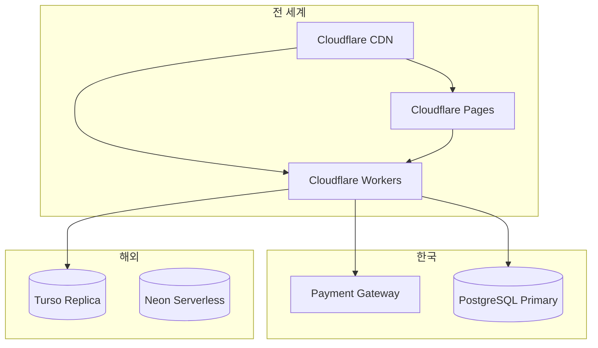
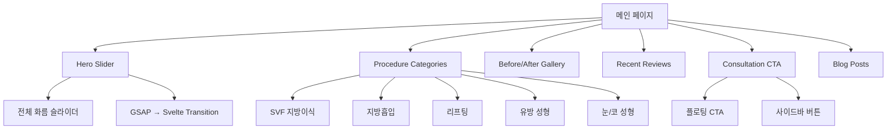
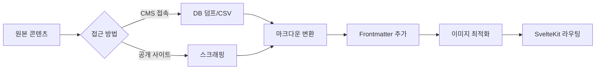

# THELINE-PS.com 마이그레이션 계획

## 개요

**대상 사이트**: https://theline-ps.com/
**목표**: 기존 Weaver CMS 기반 사이트를 Cloudflare + SvelteKit + Ranvier 아키텍처로 재구축
**핵심 요구사항**:
- 국내/해외 빠른 접속 속도
- 로그인 없는 다중 상담 경로
- SEO 최적화
- AI 엔진 검색 최적화

---

## 1. 현재 사이트 분석

### 1.1 기술 스택

| 항목 | 현재 | 이전 계획 |
|------|------|----------|
| CMS | Weaver CMS | SvelteKit + 정적 사이트 생성 |
| 프레임워크 | PHP/jQuery | SvelteKit |
| 스타일링 | Tailwind CSS | Tailwind CSS |
| 애니메이션 | GSAP, AOS | Svelte transitions |
| 슬라이더 | Swiper.js | Svelte 비슷한 컴포넌트 |
| 데이터베이스 | MySQL | PostgreSQL + Turso (글로벌) |

### 1.2 페이지 구조

```
theline-ps.com/
├── 메인 슬라이더 (전체 화면)
├── 주요 메뉴 (10개)
│   ├── 의료진 소개
│   ├── 시술 후기
│   ├── 시술/수술 메뉴
│   │   ├── SVF 지방이식
│   │   ├── 지방흡입
│   │   ├── 지방이식
│   │   ├── 리프팅
│   │   ├── 유방 확대/축소
│   │   ├── 눈 성형
│   │   ├── 코 성형
│   │   └── LAST 다이어트
│   ├── 온라인 상담
│   ├── 커뮤니티
│   ├── 병원 소개
│   └── 케이스 스터디
├── 퀵 액션 사이드바
└── 푸터
```

### 1.3 색상 체계

```css
--primary: #C98D8D;     /* 메튼트 강조색 */
--text-dark: #333333;   /* 주요 텍스트 */
--text-gray: #666666;   /* 보조 텍스트 */
--text-light: #999999;  /* 경량 텍스트 */
--bg-light: #F8F8F8;    /* 배경 */
```

### 1.4 상담 경로 분석

현재 사이트는 로그인 없이 다음과 같은 상담 경로를 제공합니다:

| 상담 유형 | 위치 | 접근성 |
|-----------|------|--------|
| 비용 상담 | 메인 페이지, 팝업 | 바로 접근 |
| 사진 비밀 상담 | 사이드바, 메인 | 바로 접근 |
| 공개 상담 | 커뮤니티 | 바로 접근 |
| 의사 Q&A | 커뮤니티 | 바로 접근 |

---

## 2. 제안 아키텍처

### 2.1 전체 구조



### 2.2 디렉토리 구조

```
surgery-clinic-site/
├── packages/
│   ├── frontend/              # SvelteKit 프론트엔드
│   │   ├── src/
│   │   │   ├── routes/
│   │   │   │   ├── (main)/
│   │   │   │   │   ├── +page.svelte          # 메인 페이지
│   │   │   │   │   ├── about/
│   │   │   │   │   ├── doctors/
│   │   │   │   │   ├── procedures/
│   │   │   │   │   ├── reviews/
│   │   │   │   │   └── consultation/
│   │   │   │   ├── (consult)/
│   │   │   │   │   ├── cost/+page.svelte     # 비용 상담
│   │   │   │   │   ├── photo/+page.svelte    # 사진 상담
│   │   │   │   │   ├── open/+page.svelte     # 공개 상담
│   │   │   │   │   └── qa/+page.svelte       # 의사 Q&A
│   │   │   │   ├── (admin)/
│   │   │   │   │   └── admin/
│   │   │   │   └── api/
│   │   │   ├── lib/
│   │   │   │   ├── components/
│   │   │   │   │   ├── HeroSlider.svelte
│   │   │   │   │   ├── ProcedureCard.svelte
│   │   │   │   │   ├── ConsultationForm.svelte
│   │   │   │   │   ├── QuickActions.svelte
│   │   │   │   │   └── FloatingCTA.svelte
│   │   │   │   ├── stores/
│   │   │   │   └── utils/
│   │   │   └── app.html
│   │   └── static/
│   └── backend/               # Ranvier 백엔드
│       ├── src/
│       │   ├── circuits/
│       │   │   ├── consultation.rs   # 상담 처리
│       │   │   ├── content.rs        # 콘텐츠 관리
│       │   │   ├── analytics.rs      # 방문 통계
│       │   │   └── admin.rs          # 관리자
│       │   ├── schemas/
│       │   └── config/
│       └── Cargo.toml
├── docs/
└── package.json
```

### 2.3 SvelteKit 어댑터 구성

```typescript
// svelte.config.js
import adapter from 'svelte-adapter-cloudflare';

export default {
    kit: {
        adapter: adapter({
            pages: {
                // 정적 사이트 미리 빌드
                prerender: {
                    handleHttp: 'verify'
                }
            },
            // Edge Functions for 상담 API
            edge: true,
            // 서비스 바운드 Worker
            serviceBindings: [
                {
                    name: 'BACKEND',
                    service: 'ranvier-backend'
                }
            ]
        })
    }
};
```

---

## 3. 컴포넌트 매핑

### 3.1 메인 페이지



### 3.2 상담 컴포넌트 구조

```svelte
<!-- src/lib/components/ConsultationForm.svelte -->
<script lang="ts">
    import { consultAction } from '$lib/actions/consultation';

    interface Props {
        type: 'cost' | 'photo' | 'open' | 'qa';
        layout?: 'inline' | 'modal' | 'sidebar';
    }

    let { type, layout = 'inline' }: Props = $props();
    let formData = $state({
        name: '',
        phone: '',
        content: '',
        // ...
    });

    // 로그인 없이 바로 제출
    async function submit() {
        const result = await consultAction(type, formData);
        // 성공/실패 처리
    }
</script>
```

---

## 4. SEO 최적화 전략

### 4.1 SvelteKit SEO 구현

```typescript
// src/lib/hooks/seo.ts
import type {SeoConfig} from '$lib/types/seo';

export function generateMetadata(page: SeoConfig) {
    return {
        title: page.title,
        description: page.description,
        openGraph: {
            title: page.ogTitle ?? page.title,
            description: page.ogDescription ?? page.description,
            images: page.ogImages ?? ['/og-default.jpg'],
            type: 'website',
            locale: 'ko_KR',
            alternateLocale: ['en_US', 'zh_CN', 'ja_JP']
        },
        twitter: {
            card: 'summary_large_image',
            title: page.title,
            description: page.description,
            images: page.ogImages
        },
        alternates: {
            canonical: page.canonical,
            languages: {
                'ko': '/ko',
                'en': '/en',
                'zh': '/zh',
                'ja': '/ja'
            }
        }
    };
}
```

### 4.2 구조화된 데이터 (Schema.org)

```typescript
// src/lib/utils/structured-data.ts
export function generateMedicalSchema(data: {
    name: string;
    description: string;
    url: string;
    address: Address;
    priceRange?: string;
}) {
    return {
        '@context': 'https://schema.org',
        '@type': 'MedicalClinic',
        name: data.name,
        description: data.description,
        url: data.url,
        address: {
            '@type': 'PostalAddress',
            ...data.address
        },
        priceRange: data.priceRange ?? '$$$',
        medicalSpecialty: 'CosmeticSurgery',
        aggregateRating: {
            '@type': 'AggregateRating',
            ratingValue: '4.8',
            reviewCount: '1250'
        }
    };
}
```

### 4.3 Sitemap 및 Robots.txt

```typescript
// src/routes/sitemap.xml/+server.ts
export async function GET() {
    const procedures = await getProcedures();
    const posts = await getBlogPosts();
    const doctors = await getDoctors();

    const urls = [
        // 메인 페이지
        { url: '', changefreq: 'daily', priority: 1.0 },
        // 시술 페이지
        ...procedures.map(p => ({
            url: `/procedures/${p.slug}`,
            changefreq: 'weekly',
            priority: 0.8
        })),
        // 블로그
        ...posts.map(p => ({
            url: `/blog/${p.slug}`,
            changefreq: 'monthly',
            priority: 0.6
        }))
    ];

    return new Response(
        generateSitemap(urls),
        {
            headers: {
                'Content-Type': 'application/xml',
                'Cache-Control': 'max-age=86400'
            }
        }
    );
}
```

---

## 5. AI 엔진 검색 최적화

### 5.1 AI 크롤러 최적화

```typescript
// robots.txt with AI bot directives
User-agent: *
Allow: /

# Google AI
User-agent: Google-Extended
Allow: /

# OpenAI GPTBot
User-agent: GPTBot
Allow: /

# Claude
User-agent: Claude-Web
Allow: /

# Perplexity
User-agent: PerplexityBot
Allow: /

# Block aggressive bots
User-agent: ChatGPT-User
Disallow: /admin/
User-agent: CCBot
Disallow: /admin/
```

### 5.2 AI 친화적 콘텐츠 구조

```markdown
<!-- 시술 페이지 예시 -->
<article class="procedure-detail">
    <!-- 1. 개요 (LLM 요약용) -->
    <section class="ai-summary">
        <h1>SVF 지방이식이란?</h1>
        <p>SVF(Stromal Vascular Fraction)는 지방 조직에서 추출한 줄기세포 풍부 성분으로,
        자가 지방이식의 생착율을 높이는 첨단 시술입니다.</p>
    </section>

    <!-- 2. 구조화된 정보 (RAG용) -->
    <section class="structured-data">
        <h2>시술 개요</h2>
        <dl>
            <dt>시술 시간</dt>
            <dd>약 2-3시간</dd>
            <dt>마취</dt>
            <dd>정맥 마취 또는 수면 마취</dd>
            <dt>회복 기간</dt>
            <dd>일상생활: 3-7일, 완전 회복: 2-4주</dd>
        </dl>
    </section>

    <!-- 3. Q&A (AI 검색용) -->
    <section class="faq">
        <h2>자주 묻는 질문</h2>
        <details>
            <summary>SVF 지방이식의 효과는 언제부터 나타나나요?</summary>
            <p>시술 후 3개월부터 생착된 지방이 안정화되며,
            6개월 후 최종 결과를 확인할 수 있습니다.</p>
        </details>
    </section>
</article>
```

### 5.3 RAG 대상 메타데이터

```typescript
// JSON-LD for AI Crawlers
<script type="application/ld+json">
{
    "@context": "https://schema.org",
    "@type": "MedicalProcedure",
    "name": "SVF 지방이식",
    "description": "줄기세포를 활용한 고생착율 지방이식",
    "medicalSpecialty": "성형외과",
    "treatmentDuration": "2-3시간",
    "recoveryTime": "일상생활 3-7일",
    "costRange": "₩8,000,000 - ₩12,000,000",
    "keywords": ["SVF", "지방이식", "줄기세포", "성형외과"],
    "faq": [
        {
            "question": "SVF 지방이식의 효과는?",
            "answer": "생착율 80% 이상, 6개월간 지속"
        }
    ]
}
</script>
```

---

## 6. 성능 최적화 전략

### 6.1 Core Web Vitals 목표

| 지표 | 목표 | 전략 |
|------|------|------|
| LCP | < 2.5s | 이미지 최적화, 프리로드 |
| FID | < 100ms | JS 축소, 코드 스플리팅 |
| CLS | < 0.1 | 레이아웃 시프트 방지 |
| TTFB | < 800ms | Cloudflare CDN + Edge Cache |

### 6.2 이미지 최적화

```typescript
// src/lib/utils/image.ts
import { image as imgOptimize } from '$lib/server/image-optimizer';

export async function getOptimizedImage(
    src: string,
    width: number,
    quality: number = 85
) {
    // WebP 변환 + 반응형 크기
    return {
        src: `/api/images/${src}?w=${width}&q=${quality}&format=webp`,
        srcset: [
            `${width * 0.5}w`,
            `${width}w`,
            `${width * 1.5}w`,
            `${width * 2}w`
        ].join(', '),
        sizes: '(max-width: 768px) 100vw, 50vw',
        loading: 'lazy',
        decoding: 'async'
    };
}
```

### 6.3 사전 로드 전략

```html
<!-- app.html -->
<head>
    <!-- Critical CSS 인라인 -->
    <style>
        /* Above-the-fold CSS만 */
        :root { --primary: #C98D8D; }
    </style>

    <!-- 프리커넥트 -->
    <link rel="preconnect" href="https://images.theline-ps.com">
    <link rel="dns-prefetch" href="https://fonts.googleapis.com">

    <!-- 프리로드 중요 리소스 -->
    <link rel="preload" href="/fonts/noto-sans-kr.woff2" as="font" type="font/woff2" crossorigin>
    <link rel="preload" href="/hero-bg.webp" as="image">

    <!-- 프리페치 다음 페이지 -->
    <link rel="prefetch" href="/procedures/svf-fat-grafting">
</head>
```

---

## 7. 다국어 지원

### 7.1 지원 언어

| 언어 | 코드 | 네이버 검색 | 구글 검색 |
|------|------|-------------|-----------|
| 한국어 | ko | ✓ | ✓ |
| 영어 | en | - | ✓ |
| 중국어 (간체) | zh-CN | - | ✓ |
| 일본어 | ja | - | ✓ |

### 7.2 URL 구조

```
/                     # 한국어 기본
/en/                  # 영어
/zh/                  # 중국어
/ja/                  # 일본어
/en/procedures/svf/   # 영어 시술 페이지
```

### 7.3 번역 관리

```typescript
// src/lib/i18n/locales/ko.json
{
    "nav": {
        "home": "홈",
        "doctors": "의료진 소개",
        "procedures": "시술 안내"
    },
    "consultation": {
        "cost": {
            "title": "비용 상담",
            "submit": "상담 신청하기"
        }
    }
}
```

---

## 8. 마이그레이션 단계

### 8.1 Phase 1: 기반 구축 (2주)

- [x] 프로젝트 구조 설정
- [ ] SvelteKit 기본 라우팅
- [ ] Tailwind CSS 테마 설정
- [ ] 공통 컴포넌트 라이브러리
- [ ] Cloudflare Pages 배포 설정

### 8.2 Phase 2: 콘텐츠 마이그레이션 (3주)

> **원본 소스 접근 여부에 따른 방법**

#### 방법 A: Weaver CMS 관리자 접속 가능 (권장)

```bash
# 1. DB 덤프 또는 CSV 내보내기
mysqldump -u user -p theline_db > backup.sql

# 2. CMS 내보내기 기능 활용
# - 게시물: CSV/JSON 형식
# - 이미지: 압축 파일 다운로드
# - 회원 정보: 별도 백업 (개인정보 주의)
```

#### 방법 B: 공개 사이트 스크래핑 (원본 없는 경우)

```typescript
// scripts/scrape-content.ts
import puppeteer from 'puppeteer';
import fs from 'fs';

// 대상 페이지 URL 목록
const pages = [
  { category: 'procedures', url: 'https://theline-ps.com/svf-fat-grafting' },
  { category: 'procedures', url: 'https://theline-ps.com/liposuction' },
  { category: 'doctors', url: 'https://theline-ps.com/doctors' },
  { category: 'reviews', url: 'https://theline-ps.com/reviews' },
  // ...
];

async function scrapePage(pageInfo) {
  const browser = await puppeteer.launch();
  const page = await browser.newPage();

  await page.goto(pageInfo.url, { waitUntil: 'networkidle2' });

  // HTML 저장
  const html = await page.content();
  const filename = pageInfo.url.split('/').pop() || 'index';
  fs.writeFileSync(`scraped/${pageInfo.category}/${filename}.html`, html);

  // 메타데이터 추출
  const metadata = await page.evaluate(() => {
    return {
      title: document.querySelector('h1')?.textContent,
      description: document.querySelector('meta[name="description"]')?.content,
      images: Array.from(document.querySelectorAll('img')).map(img => img.src),
      content: document.querySelector('.content')?.innerHTML
    };
  });

  // JSON 저장
  fs.writeFileSync(
    `scraped/${pageInfo.category}/${filename}.json`,
    JSON.stringify(metadata, null, 2)
  );

  await browser.close();
}

// 이미지 다운로드
async function downloadImages(imageUrls: string[]) {
  for (const url of imageUrls) {
    const response = await fetch(url);
    const buffer = await response.arrayBuffer();
    const filename = url.split('/').pop();
    fs.writeFileSync(`scraped/images/${filename}`, Buffer.from(buffer));
  }
}

// 실행
for (const pageInfo of pages) {
  await scrapePage(pageInfo);
}
```

#### 콘텐츠 변환 프로세스



#### 콘텐츠 체크리스트

- [ ] CMS DB 덤프 또는 스크래핑 완료
- [ ] HTML → 마크다운 변환
- [ ] 이미지 다운로드 및 최적화
- [ ] 메타데이터 (title, description, tags)
- [ ] 시술 페이지 변환 (8개)
- [ ] 의료진 페이지 변환
- [ ] 후기/케이스 스터디 변환
- [ ] 블로그 포스트 변환

### 8.3 Phase 3: 상담 시스템 (2주)

- [ ] 상담 폼 컴포넌트 개발
- [ ] Ranvier 상담 회로 연동
- [ ] 파일 업로드 (사진 상담)
- [ ] 이메일/SMS 알림
- [ ] 관리자 대시보드

### 8.4 Phase 4: SEO 및 성능 (1주)

- [ ] 메타데이터 생성
- [ ] 구조화된 데이터
- [ ] Sitemap/Robots.txt
- [ ] Core Web Vitals 최적화
- [ ] Lighthouse 점수 90+ 목표

### 8.5 Phase 5: 배포 및 검증 (1주)

- [ ] 스테이징 배포
- [ ] QA 테스트
- [ ] 성능 모니터링
- [ ] 본 배포
- [ ] 리다이렉트 설정

---

## 9. 비용 비교

### 9.1 월 예상 운영비

| 항목 | 기존 | 신규 | 절감 |
|------|------|------|------|
| 호스팅 | ₩100,000 | ₩0 | -₩100,000 |
| CDN | ₩50,000 | ₩0 | -₩50,000 |
| DB | ₩30,000 | ₩20,000 | -₩10,000 |
| SMTP | ₩20,000 | ₩0 | -₩20,000 |
| **합계** | **₩200,000** | **₩20,000** | **-₩180,000** |

* Cloudflare Free Plan + 무료 tiers 사용

### 9.2 초기 투자

| 항목 | 비용 |
|------|------|
| 개발 | ₩5,000,000 |
| 디자인 마이그레이션 | ₩2,000,000 |
| 콘텐츠 변환 | ₩1,000,000 |
| 테스트 및 QA | ₩1,000,000 |
| **합계** | **₩9,000,000** |

---

## 10. 체크리스트

### 개발 전
- [ ] 도메인 소유권 확인
- [ ] SSL 인증서 준비
- [ ] 기존 콘텐츠 백업
- [ ] 이미지 자원 수집

### 개발 중
- [ ] 접근성 (WCAG 2.1 AA)
- [ ] 의료 광고법 준수
- [ ] 개인정보처리방침
- [ ] 쿠키 정책

### 배포 전
- [ ] 네이버 서치어드바이저 등록
- [ ] 구글 서치 콘솔 등록
- [ ] 페이스북 픽셀
- [ ] 카카오 애널리틱스

### 배포 후
- [ ] 리다이렉트 모니터링
- [ ] 404 에러 확인
- [ ] 검색색인 생성 확인
- [ ] Core Web Vitals 모니터링

---

## 11. 관련 문서

- [API_DESIGN.md](./API_DESIGN.md) - API 설계
- [DATABASE_SCHEMA.md](./DATABASE_SCHEMA.md) - 데이터베이스 스키마
- [CLOUD_COST_COMPARISON.md](./CLOUD_COST_COMPARISON.md) - 비용 비교 상세
- [I18N_GUIDE.md](./I18N_GUIDE.md) - 다국어 가이드
- [MEDICAL_COMPLIANCE.md](./MEDICAL_COMPLIANCE.md) - 의료 법규 준수
